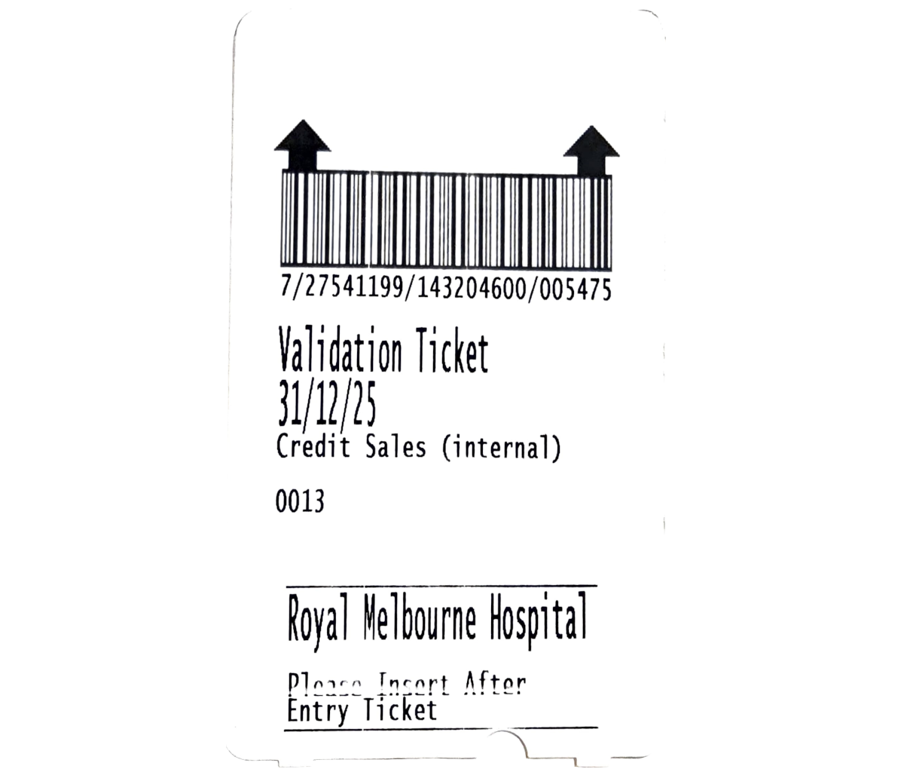

The RCH Anaesthesia department has an arrangement to ensure that staff travelling to RMH are able to safely and reliably access parking and a secure staff entrance.

## Arrangements for anaesthetists and anaesthesia technicians
Transport arrangements depend on PIPER capacity, ambulance type and the staff who have a clinical requirement to accompany the patient.

For anaesthetists or technicians who travel separately to RMH, please note that:
- Scrubs are not easily accessible from the interventional radiology complex; getting changed at RCH before travelling to RMH is recommended
- [Pre-validated parking tickets](#parking-tickets) are available in the RCH theatre in-charge office

## Staff entrance
A secure staff entrance at RMH is available for use - which is particularly useful for after-hours cases.

## Parking tickets

