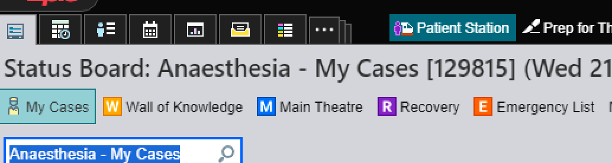
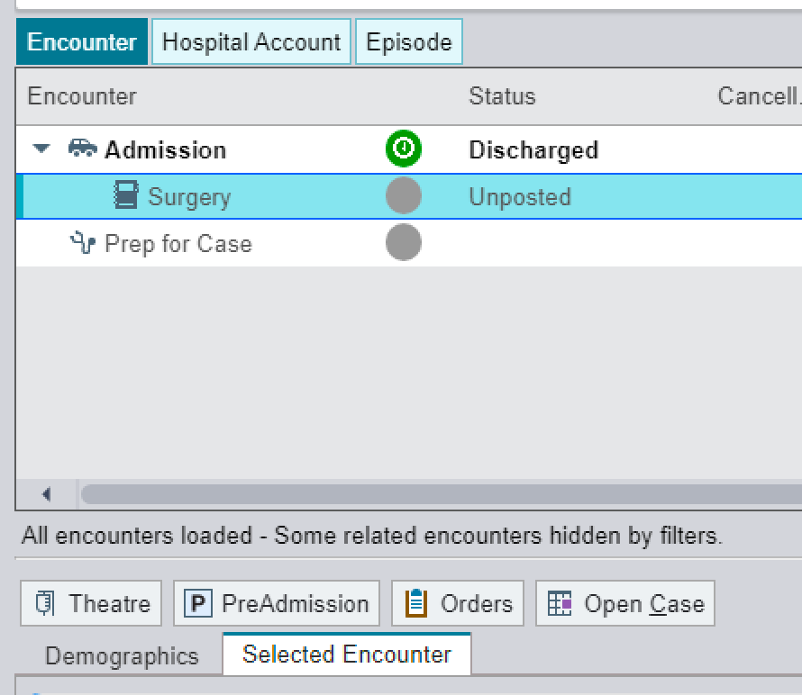
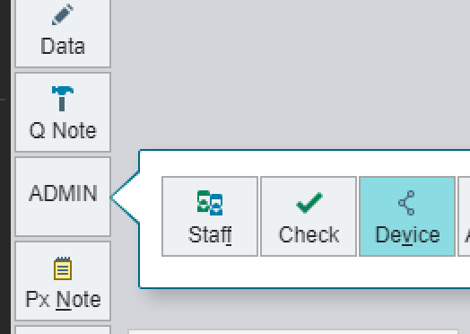

+++
title = 'Epic at RMH'
date = 2024-08-21T15:26:51+10:00
draft = false
tags = ['medical record', 'logistics', 'EMR']
+++
## Finding your patient on Epic
When the patient has been admitted to the RMH system, they will no longer be visible to RCH anaesthetists by the usual means. The best way of accessing the patient's chart on Epic is via 'Patient Station':

It is generally more reliable to use the patient's name and date of birth as identifiers, given that UR numbers may take time to be generated on admission to RMH.

## Accessing the anaesthesia chart
After entering the patient details and opening their chart, a list of encounters will be available. Single-click on the encounter corresponding to the current procedure, and a 'theatre' button will be available to access the anaesthesia chart:

This will take you to the familiar RCH theatre view.

## Associating devices
Remember that the anaesthesia machine and monitor can be added manually via the 'devices' button:

